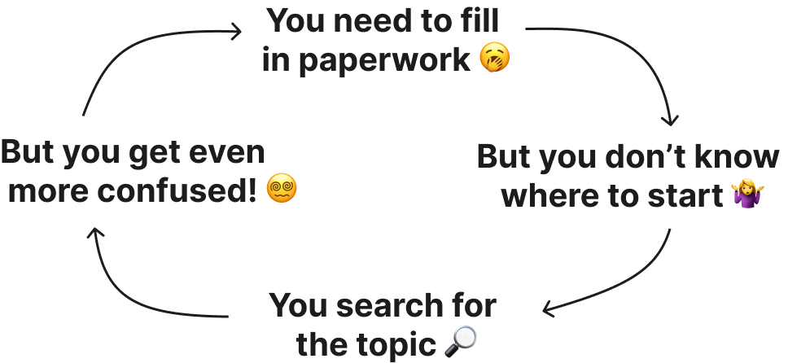

# TramitIt

## Say no to bureaucracy

Tramitit provides the information you need to navigate governmental procedures quickly.
The community provides detailed walkthroughs on every possible bureaucratic process you might go through.

The guides found in this repository is hosted in our website https://tramitit.com.

Please review our [code of conduct](./CODE_OF_CONDUCT.md).

## Contributing

- **Submitting Issues:** To submit bug reports or feature requests, please use our [issue tracker](https://github.com/tramitit/guides/issues).
- **Contributing content:** To learn more about how to contribute content see our [contributing guidelines](./CONTRIBUTING.md).

## License

Tramitit provides the guides we collect as free and open source information, released under the Creative-Commons ShareAlike license, version 4.0.

A friendly summary of the CC-BY-SA-4.0 license is provided here:
https://creativecommons.org/licenses/by-sa/4.0/
